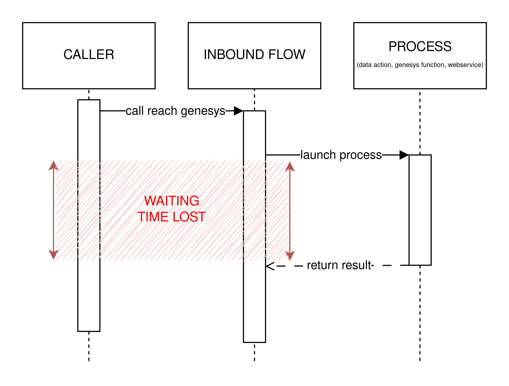
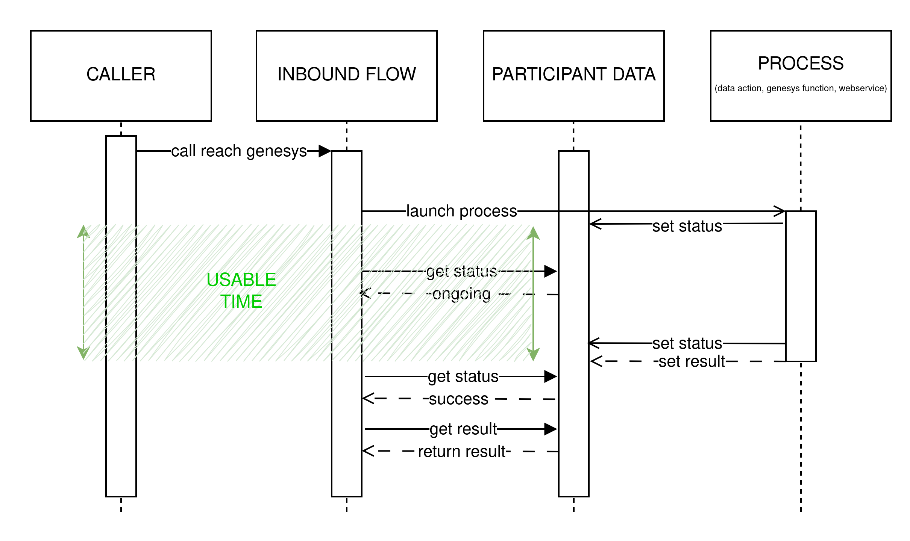

# genesys-cloud-async-worklfow
A Genesys Async Workflow is a way of doing async tasks to let customers continue their journeys while tasks are executed. This is a 100% native Genesys Cloud method.

# How it works
An initial flow will launch another process which will run independently (a workflow here, to stay in a native Genesys Cloud environment).  
Participant datas of the conversation will be the support of a bi-directionnal communication for both flows.  
The conversation id is send by the initial flow in the workflow request body.  
Then both flows are able to communicate by reading and editing participant datas of the current conversation.  

# Synchronous process

# Aynchronous process

# Sample
The Alpha company customer service's IVR  need to identify callers thanks to their calling number.  
Alpha company just bought two other concurrent, Beta and Gamma. The three customer databases merge is planned for next year.  
To be able to identify the caller, now, I need to do three HTTP rest call to three different REST webservices.  

## Option 1 : Data actions
Do three api calls, with three data actions execute one after another.  
Basic solution without any cost and easy to maintain.  
But caller will need to wait a long time if they are into the third database or not in any of them.  
Pro : Easy to create and maintain  
Cons : terrible UX due to the waiting needed during this calls

## Option 2 : Genesys Cloud Function
Create a Genesys Cloud Function to parallelize this three calls.  
Complex solution, webservice need to be coded, fully hosted on your Genesys Cloud organization.  
Better user experience, a single api call is needed : the one to this function.
Pro : better UX du to faster execution time
Cons : need developper skills to create and maintain, customer need to wait the end of execution

## Option 3 : Webservice
Create a webservice to parallelize this three calls.  
Complex solution, webservice need to be coded, deployed and maintened on an external infrastructure wich also need to be maintened.  
Better user experience, still a single api call is needed and execution can be faster than a function (based on multiple factor)  
Pro : the rest api call can be faster than a function  
Cons : need developper skills to create and maintain the service, need skill to be able to maintain where the code is running

## Option 4 : Genesys Async Workflow
Using the Geness Async Workflow.  
Medium solution, without code, fully hosted on your Genesys Cloud organization.  
The best user experience, the fully asynchronous process let your customer journey continue during the api calls.

## Timeline
### 1. Inbound flow Launch the workflow
The first step of the Genesys inbound flow is a REST call POST /api/v2/flow/execution/{workflowId}, with the conversationId and the caller number in the body.    
This REST call  is a Genesys Cloud internal call, it will be extremly fast.  
Then the caller continue his journey throught the call flow by asking the caller the reason of his call.  
### 2. Workflow start it execution
Workflow is starting his execution.  
Setting his status to ONGOING by updating a conversation caller participant data.
The first REST calls done with caller number is not finding any result.
### 3. Inbound flow need the caller identity
To get the caller identity, the flow is looking for the workflow status throught his own participant datas.  
Status is ONGOING.  
The caller continue his journey trhought the call flow by asking if this is the first time the caller issue occur.
### 4. Workflow found caller's identity
Second api calls failed again, but the third hit a result.  
Workflow add caller's identity into participant datas.  
Finaly the workflow is setting his status to SUCCESS by updating the same participant data than earlier.
### 5. Inbound flow get caller's identity
To get the caller identity, the flow is looking for the workflow status throught his own participant datas.  
Status is SUCCESS.  
Flow get caller identity thanks to the others participant datas.  
Custom user experience can begin.
