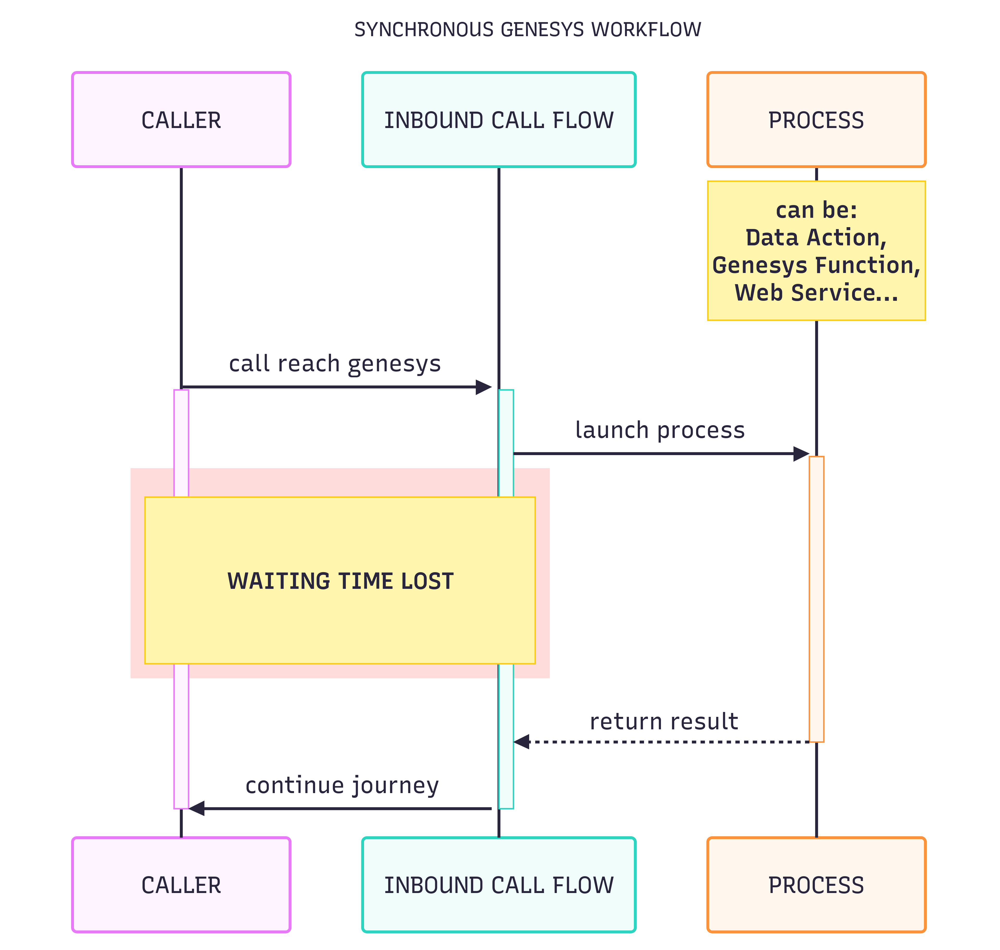
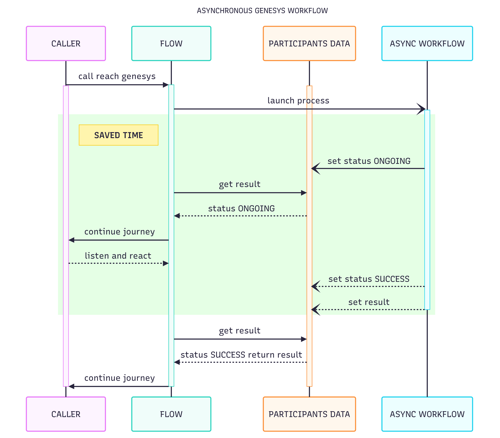

# genesys-cloud-async-workflow
A Genesys Async Workflow is a way of doing async tasks to let customers continue their journeys while tasks are executed. This is a 100% native Genesys Cloud method.

# How it works
An initial flow will launch another process which will run independently (a workflow here, to stay in a native Genesys Cloud environment).  
Participant datas of the conversation will be the support of a bi-directional communication for both flows.  
The conversation id is sent by the initial flow in the workflow request body.  
Then both flows are able to communicate by reading and editing participant datas of the current conversation.  

# Sample - AI intention recognition
By getting the STT from the caller in Genesys, you want your own AI to do the intention recognition.  
However with a long sentence, a recognition can take more than 5 seconds.  
With a synchronous process, caller has to wait all this time.
With an asynchronous process, you can interact with the caller instead.  

## Timeline - AI intention recognition
### 1. Catch caller intention
Intention is caught as text from a Genesys Cloud inbound call flow.  
### 2. Launch recognition workflow
The initial flow executes the dedicated workflow thanks to a REST call POST /api/v2/flow/execution/{workflowId}, with the conversationId and the caller intention in the body.
### 3. Recognition workflow talks to AI
The workflow executes a REST call to the target AI asking for an intention recognition based on caller's input.  
It updates its status to ONGOING in conversation participant datas. 
### 4. Customer journey continues
Inbound call flow informs the caller an event is organized by the company next Saturday for a charity.  
Then it checks in the participant datas if intention is found, but status is still ONGOING.  
Another message with more details about the event (hours, activities...).
### 5. Workflow gets AI response
AI returns caller intentions.  
Workflow adds the result in conversation's participant datas and sets its status to SUCCESS.
### 6. Customer journey can go through the queue
Inbound call flow sees workflow status in SUCCESS.  
Intention is caught, and the call can go to the corresponding queue.

# Sample - Multiple external calls
The Alpha company customer service's IVR needs to identify callers thanks to their calling number.  
Alpha company just bought two other competitors, Beta and Gamma. The three customer databases merge is planned for next year.  
To be able to identify the caller, now, I need to do three HTTP REST calls to three different REST web services.  

## Timeline - Multiple external calls
### 1. Inbound flow launches the workflow
The first step of the Genesys inbound flow is a REST call POST /api/v2/flow/execution/{workflowId}, with the conversationId and the caller number in the body.    
This REST call is a Genesys Cloud internal call, it will be extremely fast.  
Then the caller continues his journey through the call flow by asking the caller the reason of his call.  
### 2. Workflow starts its execution
Workflow is starting its execution.  
Setting its status to ONGOING by updating a conversation caller participant data.
The first REST call done with caller number is not finding any result.
### 3. Inbound flow needs the caller identity
To get the caller identity, the flow is looking for the workflow status through its own participant datas.  
Status is ONGOING.  
The caller continues his journey through the call flow by asking if this is the first time the caller issue occurs.
### 4. Workflow found caller's identity
Second API call failed again, but the third hit a result.  
Workflow adds caller's identity into participant datas.  
Finally the workflow sets its status to SUCCESS by updating the same participant data as earlier.
### 5. Inbound flow gets caller's identity
To get the caller identity, the flow is looking for the workflow status through its own participant datas.  
Status is SUCCESS.  
Flow gets caller identity thanks to other participant datas.  
Custom user experience can begin.

# Synchronous process

# Asynchronous process
